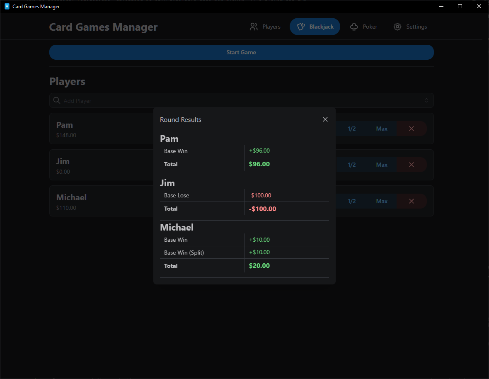
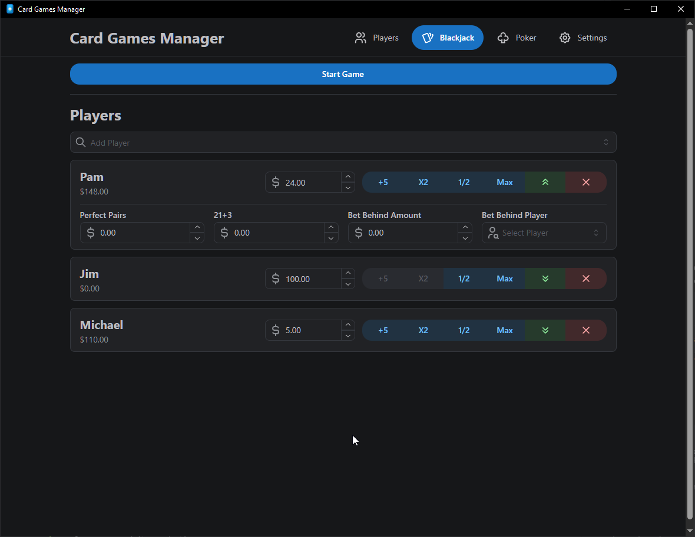

# Blackjack

[Players](./PLAYERS.md) • **Blackjack** • [Poker](./POKER.md) • [Settings](./SETTINGS.md) •
[Touchscreen Menu](./TOUCHSCREEN_MENU.md)

---

## Table of Contents

- [Pre Game](#pre-game)
- [During Game](#during-game)
- [Post Game](#post-game)
- [Sidebets](#sidebets)

---

## Pre Game

You can add and manage players and their bets before starting the game. There are multiple buttons
to quickly modify bet amounts. You can also drag the order of players around to change the order of
play. Sidebets are also configurable here.

<video src="./resources/blackjack-pregame.mp4" controls><video>

## During Game

After dealing out the physical cards, you can input the cards into the system for each player,
starting with the leftmost player. You can either click the cards or use the keybindings (default is
0-9, 1 for ace, 0 for 10/j/k/q). Unless there are sidebets, you will likely never need to input the
suit of the card, only the value.

### Hitting

Whenever a player hits, you can click the Hit button to add another empty card slot for that player,
or simply press the keybinding for the card you want to add.

### Standing

If the player chooses to stand, you can click the Stand button or press the keybinding (default is
Enter). This will move on to the next player. If you accidentally stand, or wish to go back to
another player, click the Force Turn button.

### Doubling Down

A player must have enough money to double down. Once they double down, they will receive one more
card and their bet will be doubled. If they win, they will receive double the winnings.

### Splitting

Due to technical limitations, splitting is only available once per player. If a player has two
identical cards and enough money, they can split their hand into two separate hands. Deal out the
cards for the first hand and input them like normal. Do the same for the second hand.

### Dealer's Turn

Below the dealer's total number is the recommended action for the dealer. The dealer must hit until
they reach 17 or higher. Press the Payout & End button to end the game and calculate the winnings.

The background will change colors for each player, indicating their current payout.

<video src="./resources/blackjack-duringgame.mp4" controls><video>

## Post Game

After payouts are calculated, the game will display the results for each player.

## Sidebets

Card Games Manager supports Perfect Pairs, 21+3, and Bet Behind sidebets. You can configure the
payouts, and enable or disable them in the settings. Be sure to input the suit for Perfect Pairs and
21+3.

