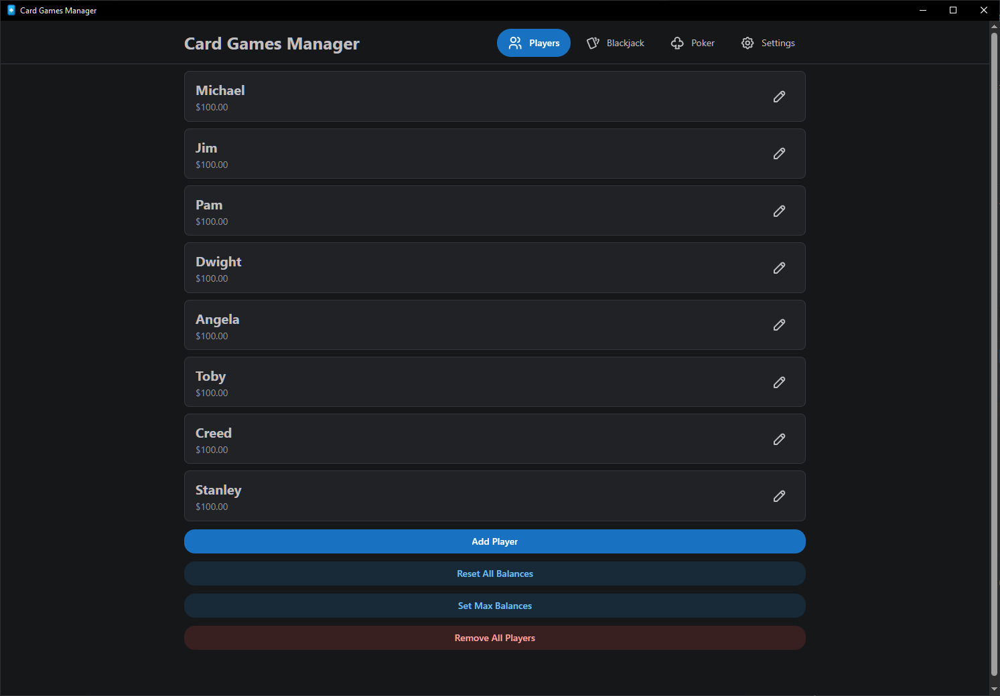

# Players

**Players** • [Blackjack](./BLACKJACK.md) • [Poker](./POKER.md) • [Settings](./SETTINGS.md) •
[Touchscreen Menu](./TOUCHSCREEN_MENU.md)

---

Players are used to keep track of balances across all games. You can have an infinite amount of
players, rename them, modify their balance, and delete them.

## Add Player

Opens a modal to add a player, with a default balance of $100.

## Reset All Balances

Sets all of the balances for all players to $100.

## Set Max Balance

Sets the balance of all players to $100M. This is useful if you do not want to keep track of money
and just want to use the app for game state management.

## Remove All Players

Deletes all players, this action cannot be undone.

---

